# CEC Quest: Long Duration Energy Storage Impact Analysis Tool


> ## About
> This program automates the collection and aggregation of data from a range of public sources. Through APIs it enables a user to download PV resource availability data, marginal operating emissions rate data, and utility rate data. It guides the user in inputting parameters for a battery energy storage model and uploading electrical load data from a site. It will then ask the user for all other relevant analysis parameters like timestep, and grid limits. It then performs a monthly optimization of 1 year of these data to determine the impact on both the site's electrical bill and the grid's greenhouse gas emissions. Lastly, it will perform a lifecycle analysis to determine how these impacts will change over a defined quantification period. Results are aggregated through automated report generation.

> **Warning**: The results of analyses using this tool are estimates based on the underlying assumptions of the models and methods used. 

# Running
> Inside your preferred terminal run the commands below depending on your system, remembering before installing Python 3.12> and all packages in requirements.txt".
> ## **Windows**:
```console
python main.py
```
> ## **MacOS and Linux**:
```console
python3 main.py
```
# Compiling
> ## **Windows**:
```console
python setup.py build
```


# Solvers for Pyomo
<a id="install-solvers"></a>
At least one solver compatible with Pyomo is required to solve optimization problems. Currently, a solver capable of solving linear programs is required. GLPK and CBC are suggested options for freely available solvers. Note that this list is not meant to be exhaustive but contains the most common viable options that we have tested. 

## Installing GLPK (for Windows)
1. Download and extract the executables for Windows linked [here](http://winglpk.sourceforge.net/).
2. The glpk_*.dll and glpsol.exe files are in the `w32` and `w64` subdirectories for 32-Bit and 64-Bit Windows, respectively. Select the pair for the appropriate version of Windows that you are using. You can place them in the same directory as the QuESt executable. 
   * Alternatively, you can place those files to the `C:\windows\system32` directory in order to have them in your system path. This will make GLPK available for the rest of your system instead of just for QuESt.
   * (When placing the files in your system path) Try running the command ``glpsol`` in the command prompt (Windows) or terminal (OSX). If you receive a message other than something like "command not found," it means the solver is successfully installed.

## Installing GLPK (for Windows via Anaconda)
If you've installed Python using Anaconda, you may be able to install several solvers through Anaconda's package manager with the following (according to Pyomo's [installation instructions](https://pyomo.readthedocs.io/en/latest/installation.html)):

``conda install -c conda-forge glpk``

## Installing GLPK (for OSX)
You will need to either build GLPK from source or install it using the [homebrew](https://brew.sh/) package manager. This [blog post](http://arnab-deka.com/posts/2010/02/installing-glpk-on-a-mac/) may be useful.

## Installing GLPK or CBC (for OSX via Anaconda)
If you've installed Python using Anaconda, you may be able to install several solvers through Anaconda's package manager with the following (according to Pyomo's [installation instructions](https://pyomo.readthedocs.io/en/latest/installation.html)):

``conda install -c conda-forge glpk``

``conda install -c conda-forge coincbc``

## Installing IPOPT (for Windows)
1. Download and extract the pre-compiled binaries linked [here](https://www.coin-or.org/download/binary/Ipopt/). Select the latest version appropriate for your system and OS.
2. Add the directory with the `ipopt.exe` executable file to your path system environment variable. For example, if you extracted the archive to `C:\ipopt`, then `C:\ipopt\bin` must be added to your path.
3. Try running the command ``ipopt`` in the command prompt (Windows) or terminal (OSX). If you receive a message other than something like "command not found," it means the solver is successfully installed.
Regardless of which solver(s) you install, remember to specify which of them to use in Settings within QuESt.


# Workflow
> **Step 1:**: Homepage. Select the MOER Data Icon to get started. 

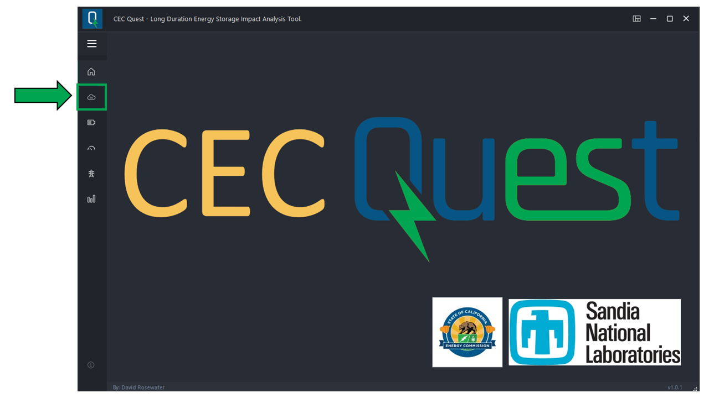

> **Step 2:**: Marginal Operating Emisions Rate (MOER) data download and selection page. 

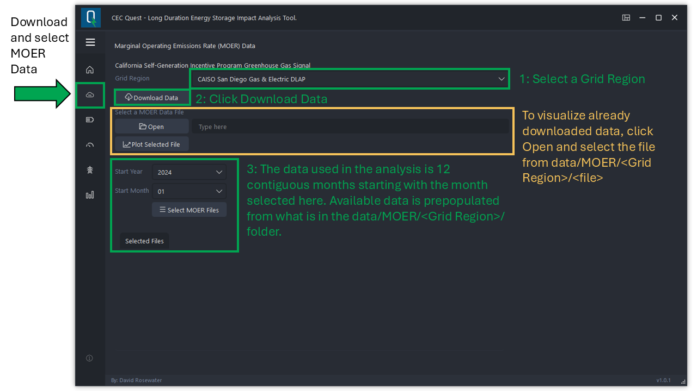

> **Step 3:**: Energy Storage Model configuration and parameterization page 

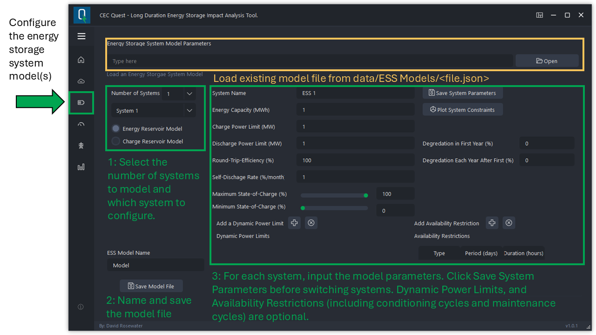

> **Step 4:**: Behind-the-Meter analysis page: Configure Solar Resouce Data

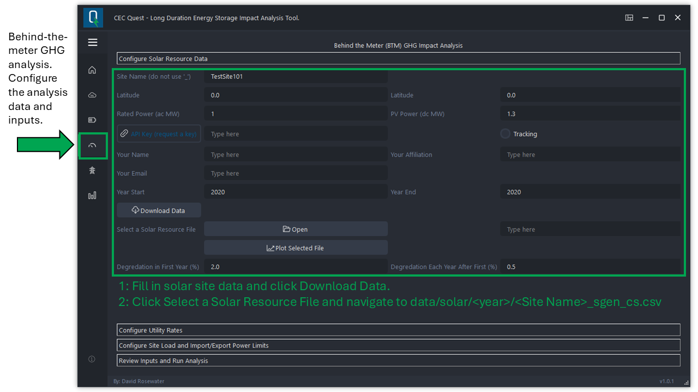

> **Step 5:**:Behind-the-Meter analysis page: Configure Utility Rates

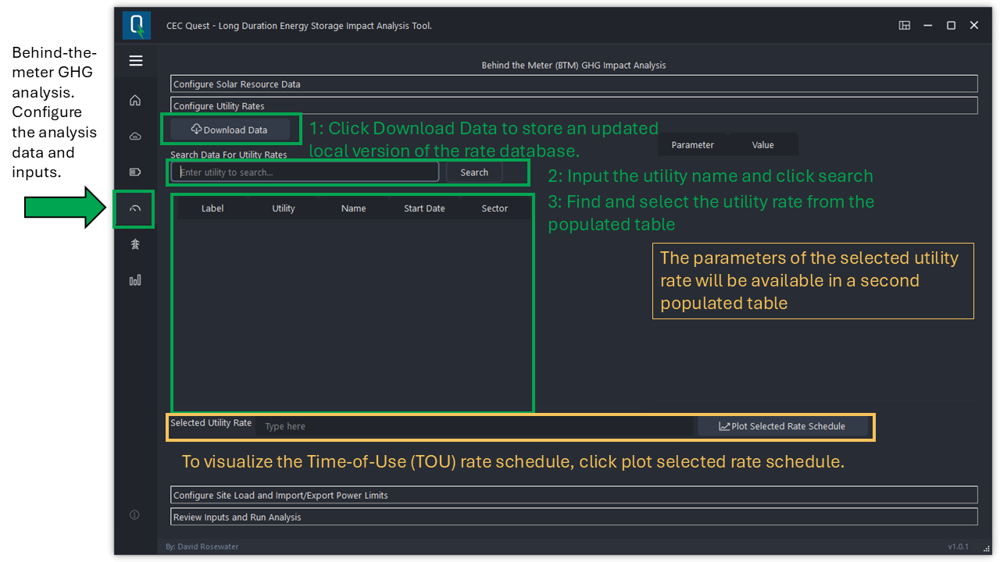

> **Step 6:**: Behind-the-Meter analysis page: Configure Site Load and Import/Export Power Limits

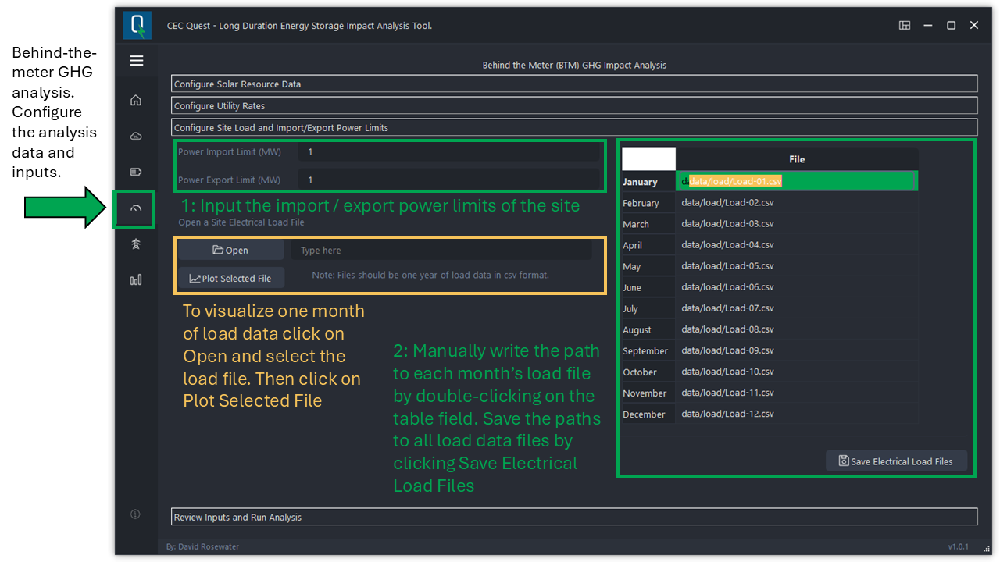

> **Step 7:**: Behind-the-Meter analysis page: Review Inputs and Run Analysis

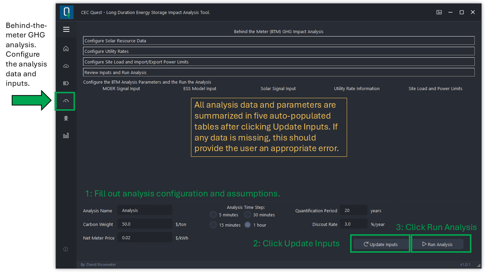

> **Step 8:**: Results: Visuilize Analysis Progress

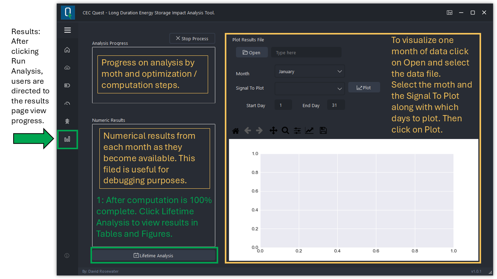

> **Step 9:**: Results: Lifetime Analysis

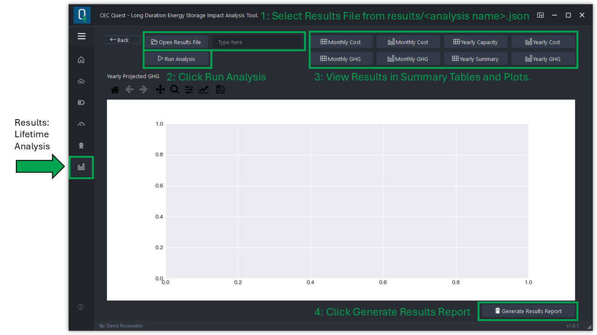

> **Energy Market Analysis:**: [RESERVED FOR FUTURE VERSIONS]

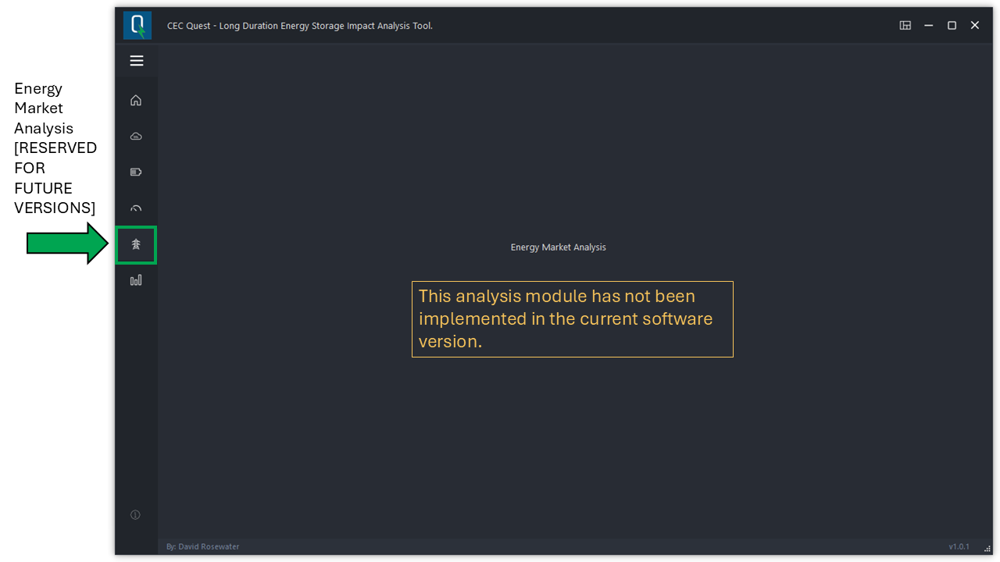

> **About**: About Page


> **Adisional Features**: Adisional Features

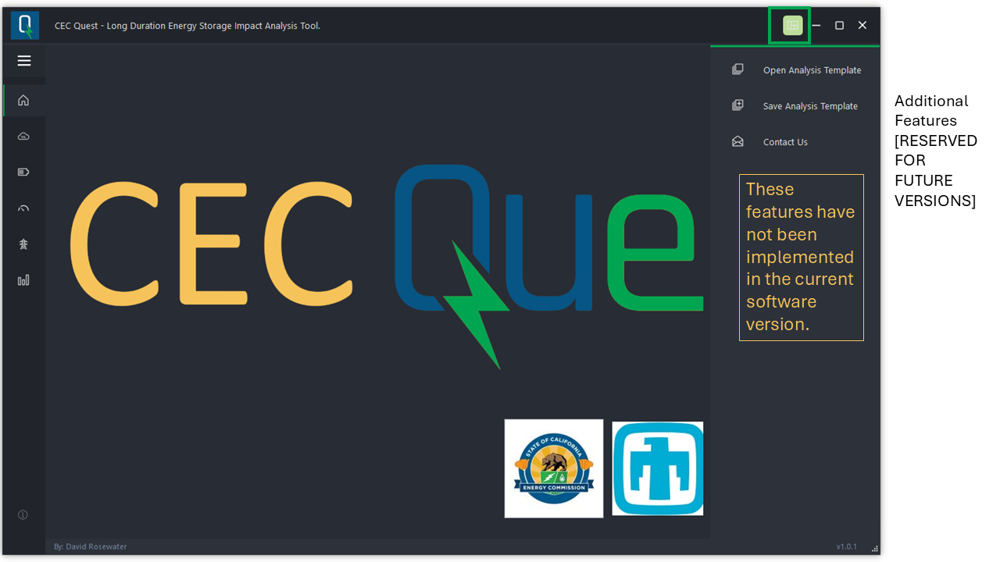


# Project Files And Folders
> **main.py**: application initialization file.

> **main.ui**: Qt Designer project.

> **resouces.qrc**: Qt Designer resources 

> **setup.py**: cx-Freeze setup to compile your application (configured for Windows).

> **themes/**: user interface theme (.qss).

> **modules/**: module for running subprocesses and the GUI.

> **modules/app_settings.py**: global variables to configure user interface.

> **modules/resources_rc.py**: "resource.qrc" file compiled for python using the command: ```pyrcc5 resources.qrc -o resources_rc.py ```.

> **modules/ui_main.py**: file related to the user interface exported by Qt Designer. You can compile it manually using the command: ```pyuic5 -x main.ui -o ui_main.py ```.
After exporting in .py and change the line "import resources_rc" to "from. Resoucers_rc import *" to use as a module.

> **modules/__static__/input_field_parameters**: Default field inputs for the GUI to prepopulate during initialization. This is where input parameters are saved. 

> **images/**: images and icons referenced by Qt Designer in the "resource.qrc" file.

> **report_templates/**: HTML files for the automated report generation.

> **results/**: File where results are saved including raw data in .json files as well as the automated reports stored in subfolders named with the date and time of their generation. 


# Manual Data Download
There are times when network issues or computer permissions make it difficult or impossible to use the automatic data download functions in this application. The following instructions enable a user to manually download files using a web browser and save them in the correct directory locations for the application to find them and use them in analyses. 


## Marginal Operating Emisions Rate (MOER) Data
Follow the link below to download the MOER data directly. 

[Self-Generation Incentive Program Data Links Page](https://data.sgipsignal.com/datalinks.html):

Then unzip and store the resulting file folder into the data/MOER sub-directory. This folder should be named according to the grid region within CAISO and should hold .csv files with the MOER signal in five minute increments with the following columns:

> timestamp	
   format YYYY-MM-DDTHH:MM:SS+(GMT-offset HH:MM)
> MOER version 2.0
   This is the signal used by the application
> MOER version 1.0 
   Present in older files. Not used. 

## Utility Rate Data
Follow the link below to download the Utility Rate data directly from OpenEI.

[United States Utility Rate Database](https://openei.org/apps/USURDB/download/usurdb.csv.gz):

Do not extract the .gz file. Simply save it in the data/rates sub-directory. 

## Solar Data 
The automated download calculates avalible solar data every half hour. Hourly data can be downloaded from:

[PVWatts Calculator](https://pvwatts.nrel.gov/):

This calculator estimates the energy production of grid-connected photovoltaic (PV) energy systems throughout the world. It allows homeowners, small building owners, installers and manufacturers to easily develop estimates of the performance of potential PV installations. 

> Input an address into the get started field and click GO>>
> Confirm the coorect latitude and longitude has been selected.
> Input the pv system data in the System Info tab.
> In the Results tab click on Download Results: Hourly
> Move the dowloaded pvwatts_hourly.csv file into the data/solar sub-directory


## Load Data 
Electrical load data should be colected at the proposed site. If those data are not avalible then the following databases include example load data from a broad range of locations. 

[Example Commercial Load Data](https://openei.org/datasets/files/961/pub/COMMERCIAL_LOAD_DATA_E_PLUS_OUTPUT/):
[Example Residential Load Data](https://openei.org/datasets/files/961/pub/RESIDENTIAL_LOAD_DATA_E_PLUS_OUTPUT/):
